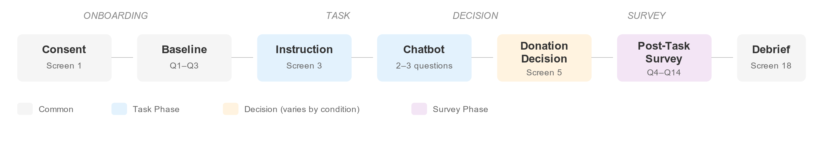

# Appendix B: Survey Instrument

## B.1 Survey Flow

**Phases:** Consent → Baseline (Q1-Q3) → Instruction → Chatbot Task → Donation Decision → Post-Task Survey (Q4-Q14) → Debrief

---

## B.2 Survey Questions

### Baseline Measures (Q1-Q3)

| # | Construct | Question | Scale |
|---|-----------|----------|-------|
| Q1 | Tech Comfort (COV) | "I am comfortable using new digital technology (like AI chatbots, new apps, or online tools)." | 6-point Likert (1=Strongly disagree, 6=Strongly agree) |
| Q2 | Privacy Concern (COV) | "In general, I am concerned about how my personal information is used online." | 6-point Likert (1=Strongly disagree, 6=Strongly agree) |
| Q3 | Ballot Familiarity (COV) | "How familiar are you with Swiss ballot initiatives?" | 6-point scale (1=Not at all familiar, 6=Very familiar) |

### Post-Task Measures (Q4-Q14)

| # | Construct | Tag | Question | Scale |
|---|-----------|-----|----------|-------|
| Q4a | Perceived Transparency | MC-T | "The information about how my anonymized chat questions may be used was clear." | 6-point Likert |
| Q4b | Perceived Transparency | MC-T | "I understood what would happen to my anonymized chat questions if I agreed to share them." | 6-point Likert |
| Q5a | Perceived Control | MC-C | "I felt I had control over how my anonymized chat questions could be used." | 6-point Likert |
| Q5b | Perceived Control | MC-C | "I felt I had meaningful choices about sharing my anonymized chat questions." | 6-point Likert |
| Q6a | Risk Perception | OUT-RISK | "Even if anonymized, my chat questions could be traced back to me." | 6-point Likert |
| Q6b | Risk Perception | OUT-RISK | "My anonymized chat questions could be used in ways I would not agree with." | 6-point Likert |
| Q7 | Trust | OUT-TRUST | "I trust the system behind this chatbot to handle anonymized questions responsibly." | 6-point Likert |
| Q8 | Attention Check | ATT | "This chatbot helps people with questions about:" | Multiple choice: Swiss ballot initiatives / Swiss tax questions / Swiss immigration rules / I don't remember |
| Q9 | Age | DEMO | "What is your age?" | Categories: 18-24 / 25-34 / 35-44 / 45-54 / 55-64 / 65+ / Prefer not to say |
| Q10 | Gender | DEMO | "What is your gender?" | Categories: Female / Male / Non-binary / Other / Prefer not to say |
| Q11 | Primary Language | DEMO | "What is your primary language?" | Categories: English / French / German/Swiss German / Italian / Romansh / Other |
| Q12 | Education | DEMO | "What is your highest level of education?" | Categories: Mandatory schooling / Matura / Vocational training / Higher vocational / University of Applied Sciences / University |
| Q13 | Voting Eligibility | DEMO | "Are you eligible to vote in Swiss federal elections?" | Categories: Eligible / Not eligible / Not sure |
| Q14 | Open Feedback | QUAL | "What mattered most for your data donation decision?" | Open text (optional, max 500 chars) |

### Construct Tags

| Tag | Construct | Purpose |
|-----|-----------|---------|
| COV | Covariate | Baseline control variables |
| MC-T | Manipulation Check - Transparency | Tests H1 manipulation effectiveness |
| MC-C | Manipulation Check - Control | Tests H2 manipulation effectiveness |
| OUT-RISK | Outcome - Risk Perception | H3 interaction mechanism |
| OUT-TRUST | Outcome - Trust | Supporting construct |
| ATT | Attention Check | Data quality screening |
| DEMO | Demographics | Sample description |
| QUAL | Qualitative | Open-ended insight |

---

## B.3 Experimental Manipulations

See Survey Navigator for condition-specific elements:
- **Condition A (T0/C0):** Generic text + binary donation choice
- **Condition B (T1/C0):** Data Nutrition Label + binary donation choice
- **Condition C (T0/C1):** Generic text + privacy dashboard
- **Condition D (T1/C1):** Data Nutrition Label + privacy dashboard

Interactive reference: https://chat-study.ailights.org/?debug=survey&key=apertus
